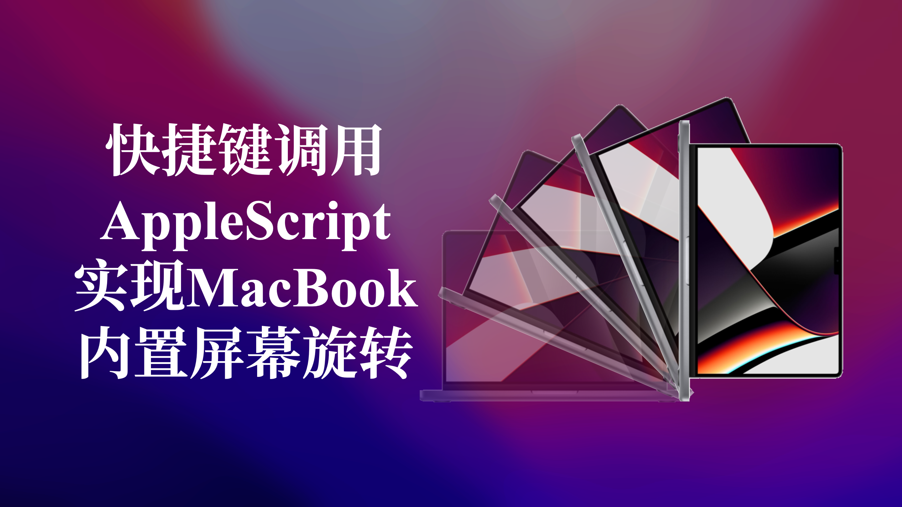

## Abstract

本文主要介绍如何通过AppleScript语言自己实现显示器一键旋转90度或一键恢复标准角度，并通过自动操作（Automator）封装成APP，并再次使用自动操作的快速操作绑定快捷键，通过键盘就可以实现显示器旋转。核心是理解AppleScript的操作逻辑，读者理解之后，可以根据自己机器版本的不同，实现同类的自动操作。

演示效果如Gif所示：

## 1 一键旋转屏幕

为什么要旋转屏幕？

> 因为我的工位电脑是这样放的，原因很简单，我希望尽可能能让显示器衔接起来，并且这样能够挡住大部分的走线，而且有利于Mac散热（多接显示器会很热）。
> 但是我也偶尔会拿着我的Mac外出，因此每次拿下电脑或者放上电脑之前，都要进行内置屏幕的旋转。
> Mac设置默认不开放旋转选项，你需要按住Option打开显示器设置，旋转的选项才会出现。屏幕旋转之后，触摸板操作方向不会改变，因此操作起来非常反人类。


方案如何实施

> 足够方便！我将组合键Control + Command + R作为一键旋转屏幕的快捷键，再拔下电脑之后，只要按一下组合键，内置屏幕就恢复为正常角度；放上电脑之前，只要按一下组合件，内置屏幕就会旋转90度，连上显示器就可以使用了。

兼容性

> 因为是针对GUI进行编写的，因此在不同的系统版本上，代码的兼容性可能较差，读者最好拥有一点点的编程基础，根据文中所述的方法一步步找到对应的控件就可以。

## 2 实现的原理

本文的逻辑如下：

- 找到要点按的按钮控件在系统偏好设置（System Preference）中的位置
- 通过设置屏幕旋转逻辑，编写AppleScript代码
- 通过自动操作（Automator）打包成应用程序（Application）
- 通过自动操作（Automator）设置脚本绑定
- 在系统偏好设置（System Preference）-键盘（keyboards）中对脚本设置快捷键

### 2.1 AppleScript

AppleScript是苹果公司推出的一种脚本语言，内置MacOS中，可以直接操作控制MacOS 以及它的应用程序，我们可以通过使用AppleScript 来完成一些繁琐重复的工作，AppleScript语法简单，接近自然语言，就像在和系统对话一样。

比如下面这个简单的代码：

```applescript
tell application "System Events" # 喂喂喂！是系统事件吗？
	delay 1 # 稍等我一秒钟哈
	if i == 1 # 你那边有1吗？
		click button "Confirm" of application process "System Preferences" # 有1啊，那你点一下“系统偏好设置”上的“确认”按钮
	else # 哦哦哦，没有1，只有0啊
		delay 2 # 那算了等一会吧
	end if # ok，没事了
end tell # 挂了，早点睡，多喝热水
```

非常直接简单的代码，如果你知道你要实现自动操作的软件的GUI布局，那么理论上你可以让他模拟你的所有操作，本篇文章也是基于此实现的。

官方文档：

[Introduction to AppleScript Language Guide](https://developer.apple.com/library/archive/documentation/AppleScript/Conceptual/AppleScriptLangGuide/introduction/ASLR_intro.html)

几篇很棒的文档：

[AppleScript 入门：探索 macOS 自动化 - 少数派](https://sspai.com/post/46912)

[手把手教你用 AppleScript 模拟鼠标键盘操作，实现 macOS 系统的自动化操作 - 少数派](https://sspai.com/post/43758)

### 2.2 Automator

自动操作（Automator）是Mac电脑上自带的一款软件，通过设置，可以实现电脑上的大部分操作自动进行，可以简单理解为一个更加硬核的快捷指令（Shortcuts）。


### 2.3 macOS的隐藏选项

macOS总是隐藏着许多你找不到的选项，必须通过同时按键盘才能出现，本文所述的旋转（Rotation）选项，也必须这样才能显示：

- 完全退出（Command + Q）系统偏好设置（System Preference）
- 打开系统偏好设置（System Preference）
- 键盘按住Option，鼠标点击显示器（Displays）
- 如果你之前没有按Option进入过，这个时候你必须回到第一步，彻底关闭重新来一遍，否则你把键盘按烂，旋转（Rotation）选项也不会出来。


## 3 嗅探要操作的UI控件

通过一小段很简单的代码，得到想要操作的按钮的UI控件，也就是在AppleScript语法中，要Tell的对象。

1. 打开自动操作（Automator），新建工作流程（Workflow）。


2. 找到**实用工具——运行AppleScript**，添加（拖拽）至右侧。


3. **打开系统偏好设置（System Preference）至你想要嗅探的界面**，比如按住Option点击显示器（Displays），进入旋转（Rotation）存在的隐藏页面。在右侧框中输入以下代码：

```applescript
tell application "System Events"
	tell process "System Preferences" # Tell Application “System Preferences”
		entire contents # Obtain All UI in “System Preferences”
	end tell
end tell
```

> 意思为：告诉系统偏好设置——“把你的东西全部给我露出来”

4. 点击右上角**运行**，运行完成后，点击**结果——{}**，复制下方框里的全部代码到随便一个IDE，方便代码阅读。


5. 通过搜索“button”，你能找到如下的这些空间的完整语句，包括部分二级菜单的选项名称，也可以找得到。

```applescript
# English 
button "Displays" of scroll area 1 of window "System Preferences" of application process "System Preferences" of application "System Events"
pop up button "Rotation:" of group 1 of window "Display" of application process "System Preferences"

# 中文
button "显示器" of scroll area 1 of window "系统偏好设置" of application process "System Preferences" of application "System Events"
pop up button "旋转：" of group 1 of window "显示器" of application process "System Preferences" of application "System Events"
```

> 你可以理解这一行代码为某个控件的地址，想要对这个按钮进行点击或者数据查询，就必须得到这个地址。如果我后面想点击这个旋转按钮，“层层召唤”和“一唤到底”都可以：

```applescript
# Way 1
tell application "System Events"
	tell application process "System Preferences"
		tell window "显示器"
			tell group 1
				click pop up button "旋转："
			end tell
		end tell
	end tell
end tell

# Way 2
click pop up button "旋转：" of group 1 of window "显示器" of application process "System Preferences" of application "System Events"
```

这一部分可能比较难理解，其实简单来说，就是要通过结果分析，得到你要模拟点击的按钮在哪，要选择的二级菜单值是什么，方便后续逻辑判断。

## 4 编写AppleScript自动操作代码

有了UI控制的具体对象，我们就可以根据我们想要实现的自动操作编写逻辑。

### 4.1 重启系统偏好设置（System Preference）

- 直接退出系统偏好设置（System Preference）
- 加一个延迟，避免quit和activate冲突
- 开启系统偏好设置（System Preference）

```applescript
tell application "System Preferences"
# quit before system preference application
	quit
	delay 0.5 # delay for avoiding conflict
end tell

tell application "System Preferences"
# open new one
	activate 
end tell
```

### 4.2 模拟按下Option进入显示器设置（Displays）

- 模拟键盘按下Option键，并延迟一下
- 模拟点击显示器（Displays），为等待UI响应加一个延迟
- 模拟键盘释放Option键

```applescript
tell application "System Events" 
# open "Displays"(en) / "显示器"(zh) windows in system preferences
	key down {option} 
	# must click with option on Monterey
	delay 0.5
	click button "Displays" of scroll area 1 of window "Displays" of application process "System Preferences"
	delay 1
	key up {option} # release option
end tell
```

> 如果key down执行，但是在key up之前发生错误中断了进程，那么直到系统收到key up的命令，否则，Option则会一直被按下，此时您无法输入任何正确的字符。
> 建议在调试之前就将key up写到其他脚本中，以免出现这样的问题。

### 4.3 设置两个状态的切换

- 定义一个标志位
- 判断当前的角度，执行if-else
- 模拟点击下拉菜单的相应角度以实现切换

```applescript
set x to 0 # create flag

tell application "System Events"
# check if the screen is rotated, and rotate it inverse:  
	tell pop up button "Rotation:" of group 1 of window "Display" of application process "System Preferences" 
		if value is "Standard" then # 0-->90
			click 
			delay 0.5
			pick menu item "90∞" of menu 1 
			set x to 0 # flag
		else # 90/180/270-->0
			click
			delay 0.5
			pick menu item "Standard" of menu 1 
			set x to 90 # flag
		end if
	end tell
end tell
```

### 4.4 点击可能出现的确认（Confirm）按钮

确认（Confirm）按钮可能会在显示器旋转后出现，而将角度复原则不会出现，这里使用上面的标志位实现。

```applescript
tell application "System Events"
# if 0-->90, a confirmation window with a countdown timer will appear
	delay 1 
	if x = 0 then # if 0-->90
		click button "Confirm" of sheet 1 of window "Displays" of application process "System Preferences"
	end if
end tell
```

### 4.5 退出系统偏好设置（System Preference）

```applescript
tell application "System Preferences"
# quit system preference application
	delay 0.5 
	quit 
end tell
```

完整代码可以在我的仓库找到：[GitHub - CLOUDUH/rotate-screen](https://github.com/CLOUDUH/rotate-screen)

## 5 打包APP并设置快捷键

### 5.1 通过Automator进行脚本的打包

1. 打开自动操作（Automator），新建一个文稿，选择**快速操作**。


2. 找到**实用工具——运行AppleScript**，添加（拖拽）至右侧，并将上面的代码粘贴在此处。


3. 选择**工作流程收到——没有输入**


4. 保存快速操作，名字随意，脚本文件将会保存在`/Users/cloudu/Library/Services`中，后缀为`rotate_screen.workflow`


### 5.2 设置快捷键

1. 打开**系统偏好设置——键盘——快捷键**，找到**服务——通用——rotate_screen**


2. 点击后面，按下快捷键即可完成，我设置为了Control + Command + R。


3. 首次运行可能会出现权限申请，可能会出现不允许发送按键的错误，请在**系统偏好设置——隐私与安全性——辅助权限**的列表中，将**系统偏好设置.app / 自动操作.app 
 / AEServer勾选**。


## 6 注意事项

代码都在我的仓库：[GitHub - CLOUDUH/rotate-screen](https://github.com/CLOUDUH/rotate-screen)

本代码仅适用于macOS Monterey 12.X，不适用于Ventura（将来会的）